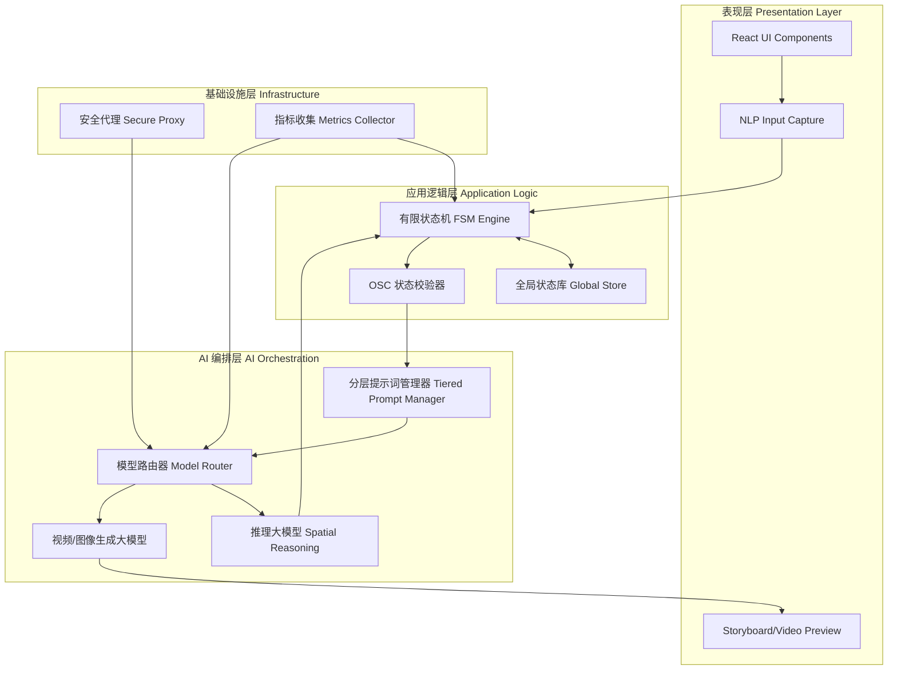
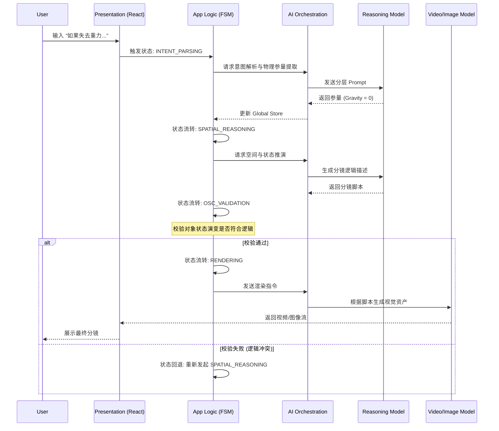

# 系统架构文档 (ARCHITECTURE)

## 1. 技术栈
- **前端框架**: React 18 + TypeScript + Vite
- **样式方案**: Tailwind CSS
- **状态管理**: Zustand
- **动画库**: Framer Motion (motion/react)
- **AI 交互**: `@google/genai` (Gemini SDK), Fetch API (DeepSeek/Doubao)

## 2. 系统全局架构图
系统自上而下分为四个核心层级：表现层、应用逻辑层、AI 编排层和基础设施层。


## 3. 核心层级与模块细节 (Core Layers Breakdown)

### 3.1 表现层 (Presentation Layer)
负责与用户进行交互，捕获自然语言假设（What-If scenarios）并展示生成的视觉分镜。
* **React UI / 组件树**：采用响应式设计，包含交互式对话窗口、参数配置面板（如重力、材质滑块）以及时间轴分镜展示区。
* **状态绑定**：UI 组件直接订阅应用逻辑层的全局状态，实现视图的实时无缝更新。

### 3.2 应用逻辑层 (Application Logic Layer) - **核心大脑**
这是整个框架管理“仿真模拟 (Emulative Simulation)”的神经中枢。
* **全局状态库 (Global Store)**：集中存储当前 Session 的所有上下文信息，包括用户的初始假设、推演出的物理参数、以及当前的分镜序列数据。
* **有限状态机 (FSM Engine)**：严格控制系统从“意图解析”到“分镜渲染”的生命周期。
  * **状态枚举**：`IDLE` (空闲) -> `INTENT_PARSING` (意图解析) -> `SPATIAL_REASONING` (空间推演) -> `OSC_VALIDATION` (OSC校验) -> `RENDERING` (渲染) -> `COMPLETE` (完成)。
* **OSC 校验器 (Object State Change Validator)**：系统核心壁垒。在此阶段拦截不符合物理逻辑的推演结果，如果校验失败，FSM 将状态回退至 `SPATIAL_REASONING` 重新生成。

### 3.3 AI 编排层 (AI Orchestration Layer)
负责将抽象的系统状态转化为具体的 AI 调度指令。
* **分层提示词管理器 (Tiered Prompt Manager)**：摒弃了硬编码的 Prompt，采用分层结构（System Persona + Context + Dynamic Physics Constraints + Output Format），根据 FSM 的当前状态动态组装最合适的提示词。
* **模型路由器 (Model Router)**：实现底层大模型的解耦。
  * **逻辑路由**：将空间推理和 OSC 校验任务路由给擅长逻辑的 LLM (如 GPT-4/Gemini 1.5 Pro)。
  * **视觉路由**：将渲染任务路由给视频/图像生成模型 (如 Sora/Runway/Midjourney API)。

### 3.4 基础设施层 (Infrastructure Layer)
* **安全代理 (Secure Proxy)**：统一管理外部 API 密钥 (API Keys)、请求限流 (Rate Limiting) 与鉴权机制，防止前端直接暴露敏感信息。
* **指标收集器 (Metrics Collector)**：异步收集系统运行数据（如各阶段耗时、OSC 校验通过率、模型 API 调用失败率），为后续框架优化提供数据支撑。

## 4. 核心架构设计
系统采用**模块化、单向数据流**的设计，将 UI 组件、状态管理和业务逻辑严格分离。
### 4.1 状态管理 (Zustand)
应用状态被拆分为三个独立的 Store，避免不必要的全局重渲染：
- `gameStore.ts`: 管理核心游戏数据（HP、背包、地图、历史记录、故事板等）。
- `uiStore.ts`: 管理界面交互状态（加载中、当前 Tab、设置步骤、弹窗显示等）。
- `settingsStore.ts`: 管理 API 配置（Provider、API Key、模型参数等）。

### 4.2 业务逻辑层 (Hooks)
- `useGameActions.ts`: 游戏的核心控制器。负责处理玩家的输入（如开始游戏、选择选项），编排 AI 调用流程，并更新 `gameStore`。
  - **防竞态设计**: 内部使用 `AbortController`，在发起新的 AI 请求时自动中止旧请求，防止异步回调导致的状态覆盖。

### 4.3 AI 服务层 (Services)
- `aiService.ts`: 封装了所有与外部 AI 模型的通信逻辑。
  - `callAI`: 调用 LLM 生成 JSON 格式的剧情和状态更新。
  - `generateImage`: 调用图像模型生成场景图。
  - `generateVideo`: 调用视频模型生成动态分镜。
- `gamePrompts.ts`: 集中管理和构建发送给 LLM 的 Prompt 模板，确保输出格式（JSON）和业务规则的严格执行。

## 5. 核心数据流 (Core Data Flow)

以下序列图展示了一次完整的“What-If”请求（如：“如果失去重力，房间会怎样？”）在系统中的流转过程：



---

## 6. 核心工作流 (AI 生成顺序)
当玩家做出选择或游戏开始时，系统严格按照以下顺序执行：
1. **文本与逻辑生成 (LLM)**: `useGameActions` 调用 `callAI`，LLM 返回包含剧情文本、选项、状态更新以及**双重分镜系统 (visual_sequence)** 的 JSON 数据。`visual_sequence` 包含 `subject_consistency`（视觉锚点）、`action_shot`（动作过程）和 `result_shot`（结果场景）。
2. **场景图像生成 (Text-to-Image)**: 解析 JSON 后，立即使用提取出的 `visual_sequence` 构建提示词，并调用 `generateImage` 生成当前场景的静态图片。如果 API 支持，会将上一帧图片作为参考图传入以保持视觉连贯性。
3. **动态视频生成 (Image-to-Video)**: 图像生成完成后，后台异步调用 `generateVideo`，传入上一帧图像（首帧）、动作描述（过程）和新生成的图像（末帧），生成连贯的动作视频并附加到故事板中。视频播放完毕后，前端会自动提取最后一帧作为下一回合的初始背景图。
4. **视频合并 (Video Join)**: 游戏结束后，在“回顾旅程”界面，前端调用后端的 `/api/video/join` 接口，使用 `fluent-ffmpeg` 将所有生成的视频片段拼接成一个完整的通关视频，并持久化保存在全局状态中，避免重复合并。

## 7. 目录结构
本项目的代码库严格按照分层架构进行组织，以确保业务逻辑、UI 渲染和 AI 调度的深度解耦。以下是核心代码目录 `src/` 的详细结构与职责说明：

```text
whatif_video_0316/
├── public/                 # 静态资源文件 (图标、全局样式等)
├── src/
│   ├── components/         # [表现层] React UI 组件
│   │   ├── Chat/           # 自然语言输入、多轮对话流组件
│   │   ├── Config/         # 物理参量配置面板 (重力、材质等滑块)
│   │   ├── Storyboard/     # 分镜时间轴组件 (渲染视频或草图序列)
│   │   └── common/         # 全局通用 UI 组件 (按钮、加载动画等)
│   │
│   ├── fsm/                # [应用逻辑层] 有限状态机引擎 (核心控制流)
│   │   ├── FSMachine.js    # 状态机主类 (定义状态节点与扭转逻辑)
│   │   ├── actions.js      # 状态扭转时触发的副作用函数
│   │   └── constants.js    # 状态枚举常量 (如 IDLE, SPATIAL_REASONING)
│   │
│   ├── store/              # [应用逻辑层] 全局状态管理
│   │   ├── useAppStore.js  # Zustand/Redux 状态切片 (存储当前假设与推演数据)
│   │   └── context.js      # 跨组件上下文共享
│   │
│   ├── validator/          # [应用逻辑层] OSC 状态校验器 (核心技术壁垒)
│   │   ├── physics.js      # 物理规则守恒校验逻辑 (重力、碰撞等)
│   │   ├── logic.js        # 上下文因果连贯性校验
│   │   └── OSCEngine.js    # 校验器主入口，决定推演结果是否被打回
│   │
│   ├── orchestrator/       # [AI 编排层] 模型调度与提示词管理
│   │   ├── tpm/            # 分层提示词管理器 (Tiered Prompt Manager)
│   │   │   ├── system.js   # 系统级 Persona 与约束提示词
│   │   │   └── dynamic.js  # 根据用户输入动态组装环境约束的逻辑
│   │   ├── router/         # 模型路由器 (Model Router)
│   │   │   ├── logicRoute.js # 将空间推演任务路由至 LLM (如 GPT-4/Gemini)
│   │   │   └── visionRoute.js# 将渲染任务路由至 Video/Image 模型
│   │   └── index.js        # 编排层向外暴露的统一调用接口
│   │
│   ├── services/           # [基础设施层] 外部 API 服务对接
│   │   ├── api.js          # 统一的 Axios/Fetch 封装，处理请求拦截
│   │   └── proxy.js        # 安全代理配置，处理 API Key 鉴权与脱敏
│   │
│   ├── utils/              # [基础设施层] 通用工具与监控
│   │   ├── metrics.js      # 性能收集器 (统计 OSC 失败率、API 耗时)
│   │   ├── logger.js       # 全局日志模块
│   │   └── helpers.js      # 数据格式化等纯函数工具
│   │
│   ├── App.jsx             # 表现层根组件，初始化 FSM 与 Store
│   └── main.jsx            # React 挂载入口
│
├── .env.example            # 环境变量配置模板 (包含所需模型 API 占位符)
├── package.json            # 项目依赖清单与构建脚本
├── ARCHITECTURE.md         # 架构设计文档 (本文档)
├── PRD.md                  # 产品需求文档
└── README.md               # 项目主页文档
```

### 目录职责说明

* **`src/validator/` (OSC 校验器)**：这是决定框架推演质量的**最核心目录**。当 AI 编排层返回了空间推演脚本后，数据必须流经 `OSCEngine.js`。只有物理规则 (`physics.js`) 和逻辑连贯性 (`logic.js`) 均返回 `true`，状态机才会允许进入下一步的视觉渲染。
* **`src/fsm/` (有限状态机)**：所有跨层级的数据流转指令（例如：前端点击发送 -> 触发推演 -> 触发渲染）都不能直接相互调用，必须由 `FSMachine.js` 统一接管和派发，确保复杂异步流程下的状态一致性。
* **`src/orchestrator/tpm/` (提示词工程)**：这里不存放硬编码的长文本，而是将 Prompt 拆分为“系统设定”、“物理约束”、“输出格式”等多个维度。根据当前场景动态组装，大幅提高了底层 AI 输出格式的稳定性。
